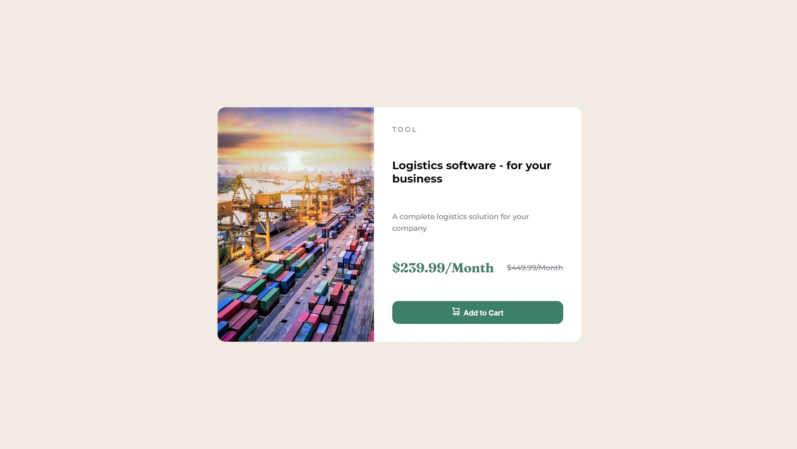

# Product preview card component

Demo: https://wkmateusr.github.io/pilot/

## INTRO

Este é um desafio Front-end do Frontend Mentor.
*This is a Frontend Mentor Frontend challenge.*

## FINALIDADE - PURPOSE

A finalidade é exibir um cartão de um determinado produto ajustável a tela.
*The purpose is to display a card of a certain product adjustable to the screen.*

## INSTALAÇÃO/ COMO UTILIZAR - INSTALLATION / HOW TO USE IT

Estrutura base em HTML e estilizado em CSS, as fontes foram importadas do googleapis, foram acrescentadas no final do código em CSS estruturas condicionais ao tamanho de exibição na horizontal para adaptar a apresentação.
*Basic structure in HTML and styled in CSS, the fonts were imported from googleapis, conditional structures were added at the end of the CSS code to the horizontal display size to adapt the presentation.*